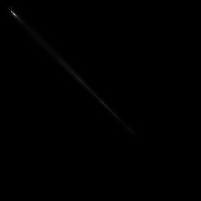
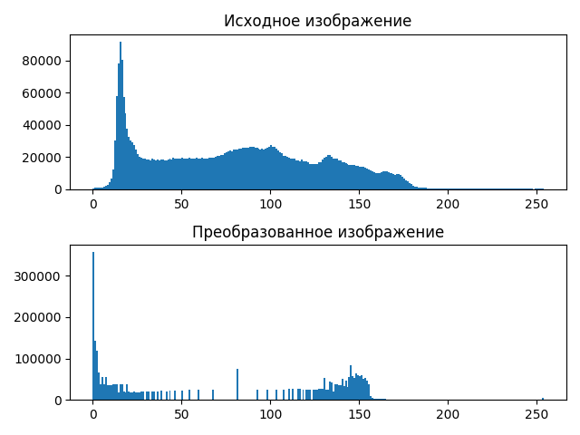

# laba8
# Лабораторная работа №8. Текстурный анализ и контрастирование.
- Параметры матрицы Харалика: d = 2, $\phi$ = {45, 135, 225, 315}
- Расчет признаков AV и D
- Логарифмическое контрастирование
- Матрицы Харалика(логарифмической нормировки) для полутоновых и контрастированных изображений

Изображение барса

### Исходное:

### Полутоновое:

### Матрица Харалика

### Признаки
AV: 56414471.0

DJ: 1.6223742852480196*10^21

DI: 1.6223742849824216*10^21

### Гистограммы

### Констрастированное изображение

### Матрица Харалика для контрастированного изображения

### Контрастированные признаки

av: 2907534.0

DJ: 2.233059114014986*10^17

DI: 2.2330591141895334*10^17

##  Изображение птицы
### Исходное:

### Полутоновое:

### Матрица Харалика

### Признаки
av: 16543429.0

DJ: 3.855510676071216*10^19

DI: 3.855510675842918*10^19

### Гистограммы

### Констрастированное изображение

### Матрица Харалика для контрастированного изображения

### Контрастированные признаки

AV: 6153574.0

DJ: 2.079588830245706*10^18

DI: 2.079588829187314*10^18

##  Изображение камней
### Исходное:

### Полутоновое:

### Матрица Харалика

### Признаки
AV:121428744.0

DJ: 1.469672391606163*10^22

DI: 1.4696723916787284*10^22

### Гистограммы

### Констрастированное изображение

### Матрица Харалика для контрастированного изображения

### Контрастированные признаки

AV: 21273573.0

DJ: 7.523529547051935*10^19

DI: 7.52352955060886*10^19

##  Изображение солнца
### Исходное:

### Полутоновое:

### Матрица Харалика

### Признаки
AV:39627600.0

DJ: 5.7269915345640004*10^20

DI: 5.726991535026848*10^20

### Гистограммы

### Констрастированное изображение

### Матрица Харалика для контрастированного изображения

### Контрастированные признаки

AV: 8022482.0

DJ: 5.42369988530267*10^18

DI: 5.423699888094444*10^18

##  Изображение города
### Исходное:

 

### Полутоновое:

### Матрица Харалика

### Признаки
AV:1566101.0

DJ: 4.889647597749464*10^16

DI: 4.889647596183467*10^16

### Гистограммы

### Констрастированное изображение

### Матрица Харалика для контрастированного изображения

### Контрастированные признаки

AV: 303977.0

DJ: 371086539933383

DI: 371086539933383

uгоргог

## Выводы
Логарифмическое контрастирование обычно уменьшает яркость изображения в целом, а так же иногда может помочь выделить текстуры объектов, несильно отличающихся по яркости. Матрица Харалика при этом меняется; параметр AV, а вместе с ним и D уменьшается
