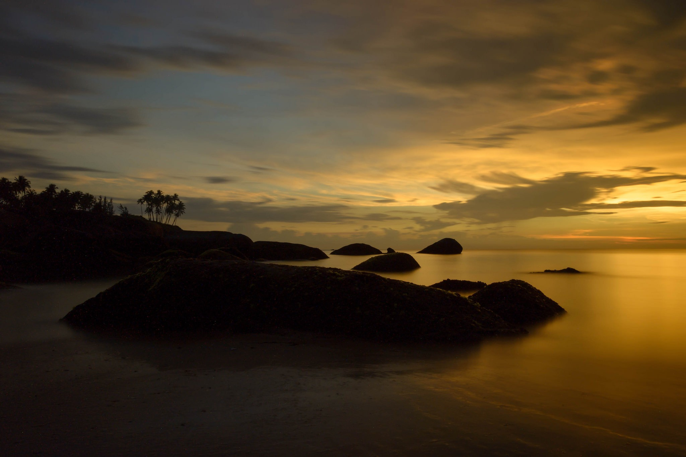

# laba8
# Лабораторная работа №8. Текстурный анализ и контрастирование.
- Параметры матрицы Харалика: d = 2, $\phi$ = {45, 135, 225, 315}
- Расчет признаков AV и D
- Логарифмическое контрастирование
- Матрицы Харалика(логарифмической нормировки) для полутоновых и контрастированных изображений

Изображение барса

### Исходное:

### Полутоновое:

### Матрица Харалика

### Признаки
AV: 56414471.0

DJ: 1.6223742852480196*10^21

DI: 1.6223742849824216*10^21

### Гистограммы

### Констрастированное изображение

### Матрица Харалика для контрастированного изображения

### Контрастированные признаки
CON (contrasted): 113983514.39752823

LUN (contrasted): 2160.9824011652677

##  Изображение птицы
### Исходное:

### Полутоновое:

### Матрица Харалика

### Признаки
av: 16543429.0

DJ: 3.855510676071216*10^19

DI: 3.855510675842918*10^19

### Гистограммы

### Констрастированное изображение (L = 7)

### Матрица Харалика для контрастированного изображения

### Контрастированные признаки
CON (contrasted): 8137120.671267983

LUN (contrasted): 408.7027770180322
##  Изображение заката
### Исходное:

### Полутоновое:

### Матрица Харалика

### Признаки
AV:1426230.0

DJ: 4.919548285905288*10^16

DI: 4.919548287616717*10^16

### Гистограммы

### Констрастированное изображение (L = 7)

### Матрица Харалика для контрастированного изображения

### Контрастированные признаки
CON (contrasted): 118477364.31172077

LUN (contrasted): 13870.39446402004

## Выводы
Логарифмическое контрастирование обычно уменьшает яркость изображения в целом, а так же иногда может помочь выделить текстуры объектов, несильно отличающихся по яркости. Матрица Харалика при этом меняется; параметр CON (контрастность), как правило, увеличивается, а параметр LUN (линейная однородность) уменьшается.
