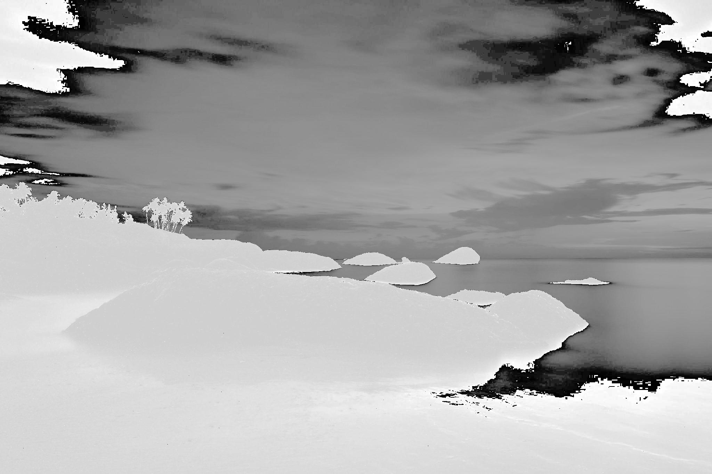

# laba8
# Лабораторная работа №8. Текстурный анализ и контрастирование.
- Параметры матрицы Харалика: d = 2, $\phi$ = {45, 135, 225, 315}
- Расчет признаков AV и D
- Линейное контрастирование
- Матрицы Харалика(логарифмической нормировки) для полутоновых и контрастированных изображений

Изображение барса

### Исходное:

### Полутоновое:

### Матрица Харалика

### Признаки
AV: 56414471.0

DJ: 1.6223742852480196*10^21

DI: 1.6223742849824216*10^21

### Гистограммы

### Констрастированное изображение

### Матрица Харалика для контрастированного изображения

### Контрастированные признаки

av: 3374161.0

DJ: 2.4219230700077226*10^17

DI: 2.421923053475095*10^17

##  Изображение птицы
### Исходное:

### Полутоновое:

### Матрица Харалика

### Признаки
av: 16543429.0

DJ: 3.855510676071216*10^19

DI: 3.855510675842918*10^19

### Гистограммы

### Констрастированное изображение

### Матрица Харалика для контрастированного изображения

### Контрастированные признаки

AV: 5787747.0

DJ: 1.75516201260298*10^18

DI: 1.7551620116190664*10^18

##  Изображение заката
### Исходное:

### Полутоновое:

### Матрица Харалика

### Признаки
AV:1426230.0

DJ: 4.919548285905288*10^16

DI: 4.919548287616717*10^16

### Гистограммы

### Констрастированное изображение

### Матрица Харалика для контрастированного изображения

### Контрастированные признаки

AV: 2068676.0

DJ: 5.206770829513478*10^16

DI: 5.206770829513478*10^16

## Выводы
Логарифмическое контрастирование обычно уменьшает яркость изображения в целом, а так же иногда может помочь выделить текстуры объектов, несильно отличающихся по яркости. Матрица Харалика при этом меняется; параметр CON (контрастность), как правило, увеличивается, а параметр LUN (линейная однородность) уменьшается.
